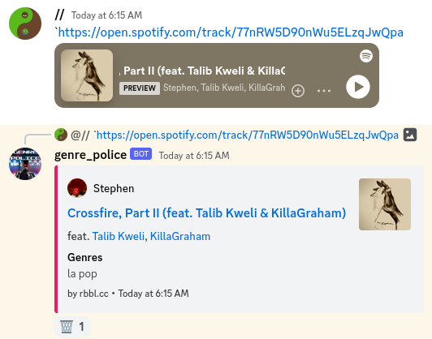

# genre-police

## about

genre-police is a discord bot, that posts the genres to spotify links that are posted without any context.

## usage

[invite](https://discord.com/oauth2/authorize?client_id=795331174649430016&permissions=0&scope=bot)

just send spotify links in any channel or via dm and the bot will answer with the genres.
this only works for `tracks`, `albums` and `artists`.

to disable the response just mention `genre` somewhere in the message.

if the bot sends a message that is not useful,
or you simply don't want the response then you can react with the waste basked emoji.



## run it

you need to supply the bot with the appropriate tokes to access both the spotify and the discord api, so you need to
register as a developer on both platforms, if you want to run this bot.

**Requirements**:
- [PostgreSQL 14](https://www.postgresql.org/)

**Parameters**:
- DISCORD_TOKEN
- SPOTIFY_CLIENT_ID
- SPOTIFY_CLIENT_SECRET
- JDBC_URL
- DB_USER
- DB_PASSWORD

example:

```shell
java -jar genre-police-1.4.1.jar \
  DISCORD_TOKEN=token \
  SPOTIFY_CLIENT_ID=id \
  SPOTIFY_CLIENT_SECRET=secret \
  JDBC_URL=url \ 
  DB_USER=userName \
  DB_PASSWORD=password
``` 

### docker/container

example:
```shell
docker run -d --name gp_1.4.1 registry.gitlab.com/rbbl/genre-police:latest \
  DISCORD_TOKEN=token \
  SPOTIFY_CLIENT_ID=id \
  SPOTIFY_CLIENT_SECRET=secret \
  JDBC_URL=url \ 
  DB_USER=userName \
  DB_PASSWORD=password
```

### build from source

**Requirements**:

- jdk11

example:

```shell
./gradlew build
java -jar target/genre-police-1.4.1.jar \
  DISCORD_TOKEN=token \
  SPOTIFY_CLIENT_ID=id \
  SPOTIFY_CLIENT_SECRET=secret \
  JDBC_URL=url \ 
  DB_USER=userName \
  DB_PASSWORD=password
```